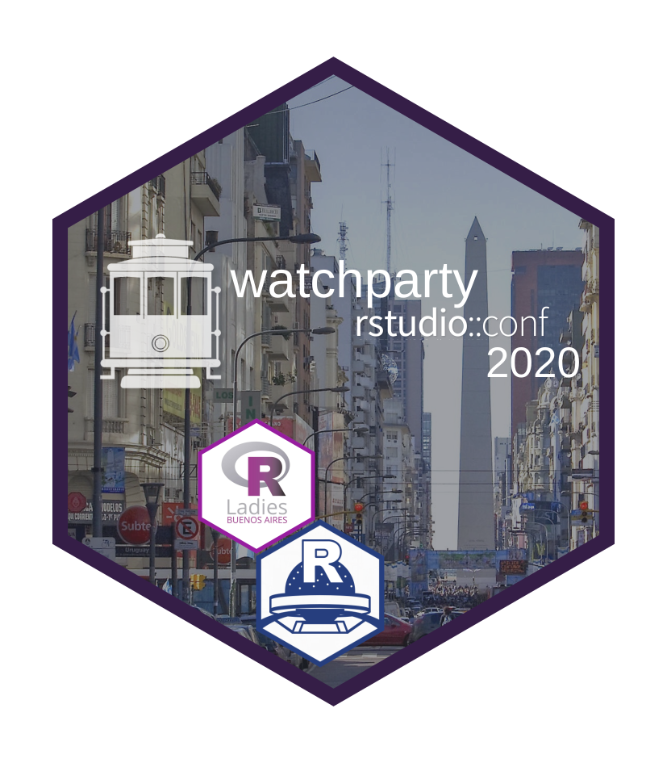

Con la escusa de ver el comienzo de la RStudio::conf2020, muchos regalitos y unas tremendas medialunas arrancamos tremprano el año junto a RLadies Buenos Aires y R en Baires.

Quienes se animaron al calor de enero también se llevaron un hex iman para la heladera

<blockquote class="twitter-tweet">
Los regalitos ya tienen dueños y dueñas!!! 🎁🎁<a href="https://twitter.com/hashtag/rstudioconf2020?src=hash&amp;ref_src=twsrc%5Etfw">#rstudioconf2020</a> <a href="https://t.co/yhVaTzqX4R">pic.twitter.com/yhVaTzqX4R</a>
&mdash; R-Ladies BuenosAires (@RLadiesBA) <a href="https://twitter.com/RLadiesBA/status/1222564128688168962?ref_src=twsrc%5Etfw">January 29, 2020</a></blockquote> 